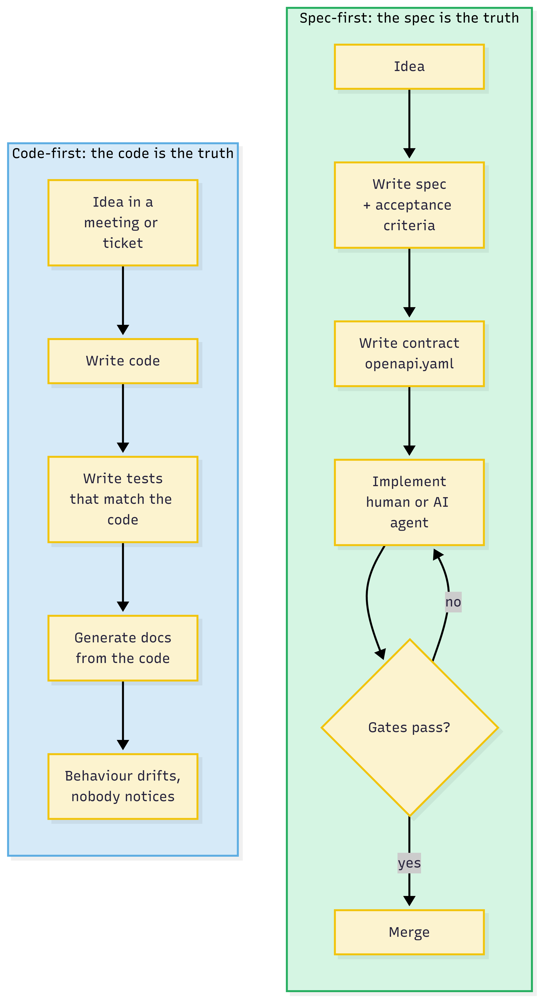
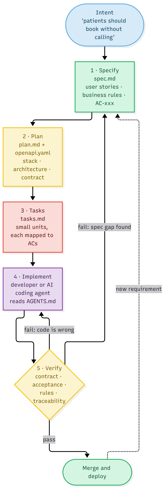
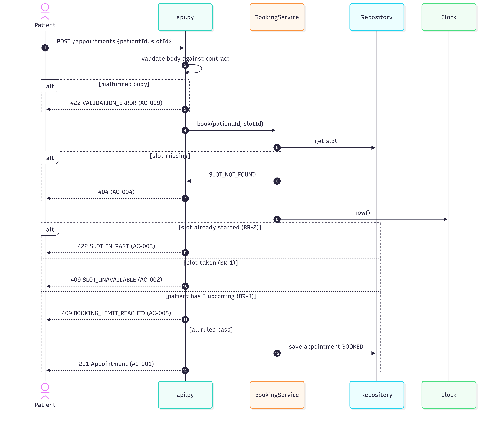
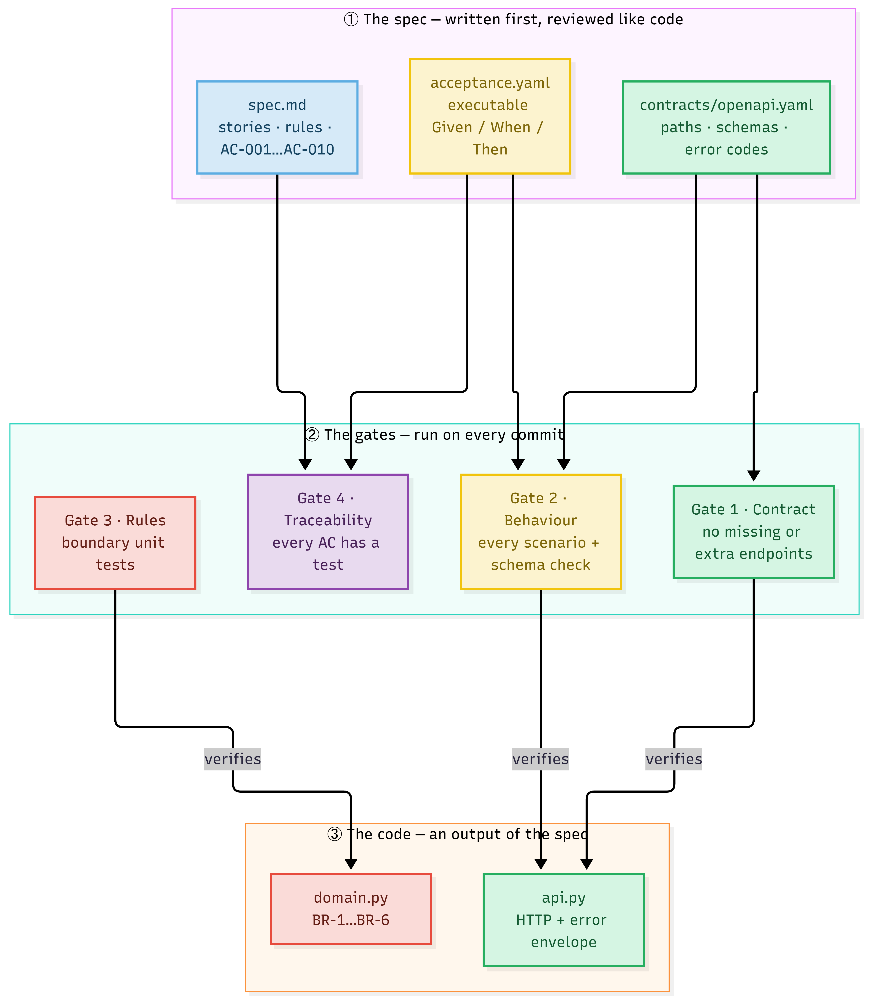
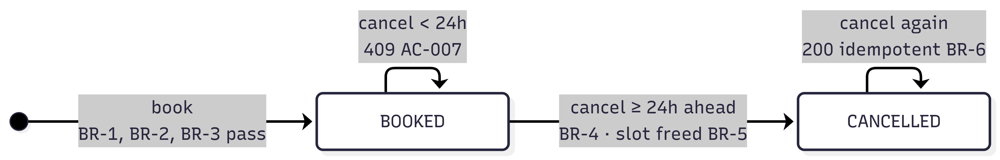
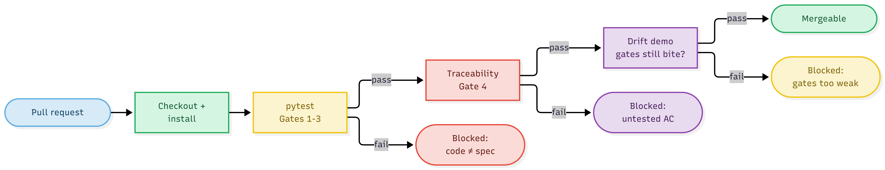

# Spec Driven Appointment Booking - A Working Guide to Spec-Driven Development
Healthcare booking API where the specification-not the code-is the source of truth, enforced by four lightweight gates that keep humans and AI agents honest.

 

> **TL;DR** — Write the spec first (`spec.md` + `openapi.yaml` + `acceptance.yaml`), let a human or an AI agent write the code, and let four automated gates decide whether the code matches the spec. Run it yourself:
>
> ```bash
> git clone https://github.com/rajarajanb/Spec-Driven-Appointment-Booking.git
> cd Spec-Driven-Appointment-Booking
> python -m venv .venv && source .venv/bin/activate   # Windows: .venv\Scripts\activate
> pip install -r requirements.txt
> python -m pytest                      # gates 1–3: 20 tests
> python tools/check_traceability.py    # gate 4: every AC covered
> python tools/drift_demo.py            # watch the gates catch 5 kinds of drift
> ```
<!-- /github-only -->

## 1. The problem: the code became the only truth

In my last project I built a natural-language provider search. Patients could finally *find* the right doctor. Then came the obvious next question: *"Great - now how do I book?"*

Booking looks simple. It is not. Can two patients take the same slot? Can you book a slot that started five minutes ago? How many upcoming appointments can one patient hold? When is it too late to cancel?

On most teams those answers live in three places: a ticket someone wrote in a hurry, the head of the developer who implemented it, and the code itself. Six months later, only the code remains - and the code cannot tell you whether a behaviour is *intended* or an *accident*.

AI coding assistants make this worse, not better. They are very good at producing plausible code quickly. If the only thing you give them is a prompt, the only thing that defines "correct" is whatever they generated.

So I changed the question from *"How do I write this faster?"* to:

> **"Where does the definition of correct live — and can a machine check it?"**

That question is the heart of spec-driven development.

## 2. What spec-driven development actually means

Spec-driven development (SDD) is simple to state:

> **The specification is the source of truth. Code is an output of the spec, and it is continuously verified against it.**

Not "we wrote a design doc once". Not "we generated Swagger from the code". The spec comes **first**, it is **versioned next to the code**, and it is **executable** - a build fails when code and spec disagree.



In this project the spec has three layers, each answering a different question:

| Layer | File | Answers | Audience |
|---|---|---|---|
| Intent | `spec.md` | *What* and *why*: stories, business rules, acceptance criteria with IDs | Product, clinic ops, engineers, AI agents |
| Contract | `contracts/openapi.yaml` | The exact API shape: paths, fields, status codes, error codes | Integrators, engineers, contract tests |
| Behaviour | `acceptance.yaml` | Given/When/Then examples that a machine can run | CI, reviewers |

Tools like GitHub's Spec Kit and AWS Kiro formalise the same *specify → plan → tasks → implement* flow for AI agents. In this repo I deliberately used plain Markdown, YAML and pytest, so you can see every moving part and adopt it on any stack.

## 3. The lifecycle



The important detail is that **there are two ways to fail verification**:

- **The code is wrong** → go back and fix the implementation.
- **The spec has a gap** → go back and fix the *spec*, not the code.

The second loop is what most teams skip. When an AI agent or a developer "just handles" an unspecified case in code, the behaviour becomes invisible. In SDD, an unspecified case is a spec change, reviewed like any other.

## 4. Step 1 - Specify: write down what "correct" means

`spec.md` contains no frameworks and no databases. Just users, rules and acceptance criteria:

```markdown
## Business rules
- BR-1 A slot can hold at most one active (BOOKED) appointment.
- BR-2 Slots that start at or before the current time cannot be booked.
- BR-3 A patient may hold at most 3 active upcoming appointments.
- BR-4 A patient may cancel only when the appointment starts 24 hours or more from now.
- BR-5 A cancelled appointment frees its slot immediately.
- BR-6 Cancelling an already-cancelled appointment is idempotent.

## Acceptance criteria
- AC-002 (US-2, BR-1) Given a slot that is already booked, when another patient
  books it, then the API returns 409 with code SLOT_UNAVAILABLE.
- AC-007 (US-3, BR-4) Given a booking that starts in less than 24h, when the
  patient cancels, then the API returns 409 with code CANCELLATION_WINDOW_CLOSED.
```

Two small habits make this spec *machine-friendly*:

1. **Every criterion has a stable ID** (`AC-001`…`AC-010`). Tests reference these IDs, so we can prove coverage.
2. **Every error has an exact code** (`SLOT_UNAVAILABLE`). The same strings appear in the contract and the code - and a test checks that they match.

Notice BR-6. I only discovered it while writing tests: *"what happens if someone cancels twice?"* In a code-first world I would have picked an answer inside an `if` statement. Here it became a one-line rule that product can read and challenge.

## 5. Step 2 - Plan and contract: decide *how*, and pin the API shape

`plan.md` records the technical decisions - Python, FastAPI, an in-memory repository, and one decision that matters more than the rest:

> **The contract is hand-written and reviewed before code. It is never generated from the code.**

If you generate OpenAPI from your implementation, the "contract" simply describes whatever you built - bugs included. Writing it first turns it into a promise:

```yaml
# simplified excerpt of contracts/openapi.yaml
/appointments:
  post:
    operationId: bookAppointment
    responses:
      "201": { $ref: Appointment }
      "404": { $ref: Error }   # SLOT_NOT_FOUND
      "409": { $ref: Error }   # SLOT_UNAVAILABLE, BOOKING_LIMIT_REACHED
      "422": { $ref: Error }   # SLOT_IN_PAST, VALIDATION_ERROR

Appointment:
  type: object
  additionalProperties: false      # no surprise fields
  required: [id, patientId, providerId, slotId, start, status]
```

`additionalProperties: false` looks strict. That is the point: if a developer (or an agent) adds a field, the contract must change first.

The plan also introduced one design choice driven directly by the spec: an injectable **Clock**. Rules like "can't book the past" and "24-hour cancellation window" are untestable if code calls `datetime.now()` directly. The spec said *NFR-3: rules must be testable with a controllable clock* - so the plan made it so.

## 6. Step 3 - Tasks: small, traceable units of work

`tasks.md` breaks the plan into pieces that each map to acceptance criteria:

| Task | Satisfies |
|---|---|
| T5 `BookingService.book()` enforcing BR-1, BR-2, BR-3 | AC-001 … AC-005 |
| T6 `BookingService.cancel()` enforcing BR-4, BR-5 | AC-006, AC-007 |
| T7 HTTP layer + error-envelope handlers | AC-009, AC-010 |

A task is "done" only when its ACs pass in CI. That definition works equally well for a pull request from a colleague and for a run of an AI coding agent.

## 7. Step 4 - Implement: humans and AI agents follow the same rules

The repo contains an `AGENTS.md` file that tells any coding agent - Claude Code, Copilot, Cursor, Kiro - how to behave here:

```markdown
- Never change behaviour that is not described in spec.md. If the spec is unclear,
  stop and propose a spec change instead of guessing in code.
- Never edit openapi.yaml to make a failing test pass.
- Definition of done: python -m pytest && python tools/check_traceability.py
```

The prompts become boring, which is exactly what you want:

> *"Implement task T6 from specs/001-appointment-booking/tasks.md. Only BR-4 and BR-5. Run the gates and tell me which ACs now pass."*

The domain code itself is intentionally plain. Each rule carries its ID, so a reviewer can walk from spec to line:

```python
if slot.start <= now:                                   # BR-2
    raise DomainError("SLOT_IN_PAST", 422, "This slot has already started")
if self.repo.active_appointment_for_slot(slot_id):     # BR-1
    raise DomainError("SLOT_UNAVAILABLE", 409, "This slot is already booked")
if len(active) >= MAX_ACTIVE_APPOINTMENTS:              # BR-3
    raise DomainError("BOOKING_LIMIT_REACHED", 409, "...")
```



## 8. Step 5 - Verify: four gates between the spec and the code

This is where spec-driven development stops being documentation and becomes engineering.



**Gate 1 - Contract.** The running app must expose exactly the operations in `openapi.yaml`. Missing endpoint? Fail. Extra endpoint nobody specified? Also fail.

**Gate 2 - Behaviour.** Every scenario in `acceptance.yaml` runs against a fresh app with a frozen clock. Scenarios are plain YAML, so product people can read them:

```yaml
- id: AC-007
  title: Cancelling less than 24h ahead is rejected
  steps:
    - request: { method: POST, path: /appointments,
                 body: { patientId: P-301, slotId: PR-001-D1-0800 } }
      expect: { status: 201 }
      save: { apptId: id }
    - request: { method: POST, path: "/appointments/{apptId}/cancel" }
      expect: { status: 409, body: { code: CANCELLATION_WINDOW_CLOSED } }
```

And every response - success or error - is validated against the OpenAPI schema for that exact status code. This is the piece I like most, and it is only a few lines:

```python
def assert_conforms_to_contract(method, path, status, body):
    template, op = find_operation(method, path)
    assert str(status) in op["responses"], f"{status} is not documented"
    schema = op["responses"][str(status)]["content"]["application/json"]["schema"]
    validator = Draft202012Validator({**schema, "components": OPENAPI["components"]})
    errors = list(validator.iter_errors(body))
    assert not errors, f"{method} {template} {status} violates the contract"
```

**Gate 3 - Rules.** Fast unit tests on the domain, focused on boundaries the scenarios don't cover - exactly 24 hours before, one minute inside the window, a slot starting *now*. Each is tagged with its AC: `@pytest.mark.ac("AC-006")`.

**Gate 4 - Traceability.** A 60-line script reads every `AC-xxx` from `spec.md`, finds every scenario and tagged test, and fails if any criterion is uncovered - or if a test points to a criterion that no longer exists.

```text
10 criteria · 10 covered · 0 uncovered · 0 orphan references
PASS: every acceptance criterion is covered
```



## 9. The moment it clicked: watching the gates catch drift

Green tests prove little on their own. What I wanted to know was: *would these gates catch the kind of change that slips through code review?*

So the repo includes `tools/drift_demo.py`. It copies the project to a temp folder, makes one innocent-looking change at a time, and runs the gates:

```text
[    CAUGHT] Developer adds an extra 'notes' field to the Appointment response
             POST /appointments 201 violates the contract: 'notes' was unexpected
[    CAUGHT] Developer returns 400 instead of 409 for a double booking
             AC-002 step 2: POST /appointments -> 400
[    CAUGHT] Developer quietly raises the booking limit from 3 to 5
             AC-005 step 4: POST /appointments -> 201
[    CAUGHT] Developer adds a DELETE endpoint that is not in the contract
             Implemented but not in the contract (update the spec first)
[    CAUGHT] Product adds AC-011 to spec.md but nobody writes a test for it
             FAIL: uncovered criteria: AC-011

5/5 drifts caught by the spec gates
```

Every one of these would pass a quick review. "Raise the limit to 5" might even be a *good* idea - but in SDD it is a spec change that product approves, not a constant someone edits on a Friday.

## 10. Putting it in CI



The workflow is short: install, run pytest (gates 1–3), run traceability (gate 4), then run the drift demo as a guard that the gates themselves haven't been weakened. A pull-request template asks one question first: *which spec and which ACs does this change?*

## 11. What spec-driven development is not

It is fair to ask whether this is just waterfall with YAML. A few honest observations:

- **It is not big design up front.** Spec 001 is two pages. Rescheduling is explicitly *out of scope* and will be spec 002. Specs are small and incremental.
- **Specs rot too - unless they are executable.** A spec that no build checks is just a nicer wiki page. The gates are what keep it alive.
- **It costs something.** Writing `acceptance.yaml` took longer than writing the domain code. That time moved from debugging and re-explaining to the start of the work, where it is cheaper.
- **It fits some work better than others.** APIs, business rules, integrations and regulated domains like healthcare benefit most. Exploratory UI work and spikes benefit less - prototype first, then specify what you learned.

## 12. The architectural lesson

In the provider-search project the lesson was: *use AI where language understanding is valuable; use deterministic systems where correctness matters.*

This project taught the same lesson from the other side:

> **Let humans and AI write the code. Let the spec decide what "correct" means - and let a machine check it on every commit.**

As more of our code is generated, the spec becomes the most valuable thing we write by hand.

## 13. Try it yourself

The full working solution - specs, contract, FastAPI implementation, the four gates, the drift demo, CI and all the diagrams in Mermaid - is on GitHub:

👉 **https://github.com/rajarajanb/Spec-Driven-Appointment-Booking**

Clone it, run `python tools/drift_demo.py`, then try this: add a rescheduling feature. Start with `specs/002-rescheduling/spec.md` - not with the code - and see how it changes the conversation.

*If you try it on your own stack, I'd love to hear what your gates catch.*

<!-- github-only -->
---

## Appendix - Repository layout

```text
.
├── AGENTS.md                          # rules for AI coding agents
├── specs/001-appointment-booking/
│   ├── spec.md                        # WHAT & WHY: stories, BR-1..6, AC-001..010
│   ├── plan.md                        # HOW: stack, architecture, gates
│   ├── tasks.md                       # T1..T9 mapped to ACs
│   ├── acceptance.yaml                # executable Given/When/Then
│   └── contracts/openapi.yaml         # hand-written API contract
├── src/booking/                       # clock, repository, domain, api
├── tests/                             # contract, acceptance, rules
├── tools/
│   ├── check_traceability.py          # gate 4
│   └── drift_demo.py                  # proves the gates bite
├── docs/diagrams/*.mmd                # Mermaid sources
├── docs/images/*.png                  # rendered diagrams  (PNG copies)
├── docs/traceability.md               # generated AC → test matrix
├── .github/
│   ├── workflows/spec-gates.yml       # CI: runs all gates on every push / PR
│   └── pull_request_template.md       # spec-first PR checklist
└── requirements.txt · pytest.ini · Makefile · LICENSE · .gitignore
```

## Appendix - Run the API

```bash
uvicorn booking.main:app --app-dir src --reload
# open http://127.0.0.1:8000/docs
curl "http://127.0.0.1:8000/providers/PR-001/slots?date=$(date -u +%F)"
curl -X POST http://127.0.0.1:8000/appointments \
     -H "Content-Type: application/json" \
     -d '{"patientId":"P-100","slotId":"PR-001-D2-0930"}'
```

Slot IDs are relative to today (UTC): `PR-001-D2-0930` = provider PR-001, two days from now, 09:30.

*All data in this repository is synthetic. This is a teaching example, not a production booking system (no auth, no persistence).*
